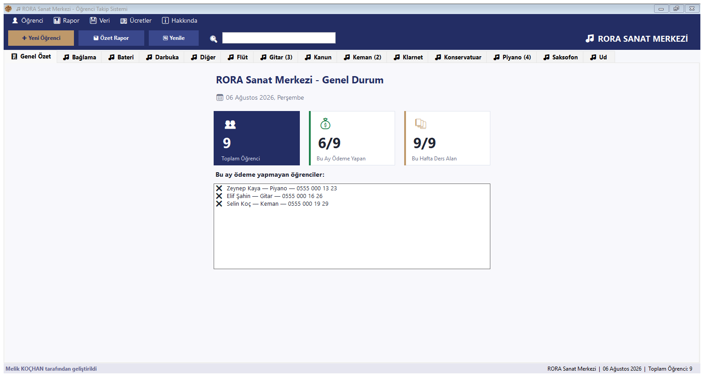
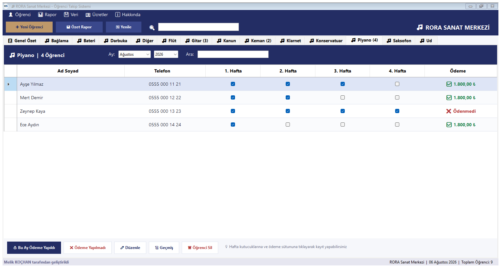
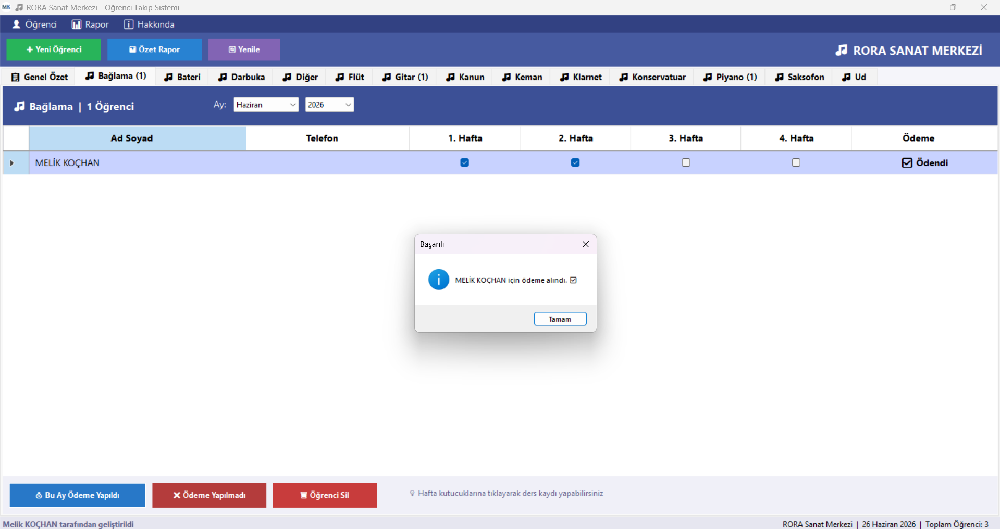

# 🎵 RORA Sanat Merkezi — Öğrenci Takip Sistemi

C# ve Windows Forms ile geliştirilmiş masaüstü uygulaması.

## 📌 Proje Hakkında

RORA Sanat Merkezi için geliştirilen bu uygulama; öğrenci kayıt, haftalık ders takibi ve aylık ödeme yönetimini dijital ortama taşımaktadır. Sunucu, veritabanı veya internet bağlantısı gerektirmez; tüm veri kullanıcının kendi bilgisayarında XML dosyası olarak saklanır.

## ✨ Özellikler

**Öğrenci yönetimi**

- Öğrenci kayıt, düzenleme ve silme (silmeden önce onay sorulur)
- Telefon biçimi doğrulaması ve mükerrer kayıt uyarısı
- Çalgı türüne göre sekmeli arayüz
- Sekme içinde öğrenci arama, tüm çalgılarda birden genel arama

**Ders ve ödeme takibi**

- 4 haftalık ders takibi (işaret kutusu ile)
- Aylık ödeme yönetimi (ödeme alma ve geri alma)
- Ödeme tutarı takibi ve gelir raporlaması
- Çalgı bazlı ders ücreti tanımları; ödeme alınırken tutar varsayılan olarak gelir
- Ayın 15'inden sonra çalışan ödeme hatırlatıcısı

**Raporlama**

- Aylık özet raporu, masaüstüne `.txt` olarak
- Aynı raporun logolu PDF çıktısı
- Bu ay, önceki ay veya seçilen herhangi bir ay/yıl için rapor

**Veri güvenliği**

- Veriler XML biçiminde yerel olarak saklanır
- Menüden yedek alma ve yedekten geri yükleme
- Açılışta otomatik yedek (son 7 gün saklanır)
- Kayıt dosyası atomik yazılır; yarım yazma veri kaybettirmez
- Uygulama tek örnek çalışır, iki pencerenin birbirini ezmesi engellenir

## 🖼️ Ekran Görüntüleri

**Genel Özet** — toplam öğrenci, bu ay ödeme yapan, bu hafta ders alan sayıları ve borçlu listesi



**Çalgı sekmesi** — ay/yıl filtresi, haftalık ders kutucukları ve ödeme durumu



**Ödeme alma** — seçili öğrenci için seçili aya ödeme işleme



## 🛠️ Kullanılan Teknolojiler

- C#
- .NET Framework 4.7.2
- Windows Forms
- XML Serialization

## 🚀 Kurulum

Ayrıntılı adımlar için [docs/Installation.md](docs/Installation.md) dosyasına bakınız.

```bash
git clone https://gitlab.com/Melikkochan/RORAMuzikMerkezi.git
```

Projeyi Visual Studio ile açıp derlemeniz yeterlidir; harici bağımlılık yoktur.

PDF raporu, Windows'un yerleşik **Microsoft Print to PDF** yazıcısını kullanır. Bu yazıcı kaldırılmışsa yalnızca PDF çıktısı alınamaz; uygulamanın geri kalanı ve `.txt` raporu etkilenmez.

## 💾 Veri Konumu

Tüm veri tek bir dosyada tutulur, yedekler onun yanındaki klasöre yazılır:

```
%AppData%\RORAMuzikMerkezi\veriler.xml
%AppData%\RORAMuzikMerkezi\yedekler\
```

Uygulama her açılışta otomatik yedek alır ve son 7 günü saklar. Elle yedek almak için **💾 Veri → 📤 Yedek Al...**, geri dönmek için **📥 Yedekten Geri Yükle...** menüsünü kullanın. Klasörü doğrudan açmak için **📂 Veri Klasörünü Aç** yeterlidir.

## 📚 Dokümantasyon

| Belge | İçerik |
|---|---|
| [ProjectOverview.md](docs/ProjectOverview.md) | Projenin amacı ve kapsamı |
| [Architecture.md](docs/Architecture.md) | Katmanlar ve veri akışı |
| [Requirements.md](docs/Requirements.md) | İşlevsel ve işlevsel olmayan gereksinimler |
| [Installation.md](docs/Installation.md) | Kurulum ve derleme adımları |
| [SprintPlan.md](docs/SprintPlan.md) | Sprint planı ve durumu |
| [FutureImprovements.md](docs/FutureImprovements.md) | Planlanan geliştirmeler |

## 👤 Geliştirici

Melik KOÇHAN

---

# 🎵 RORA Art Center — Student Tracking System

A desktop application developed with C# and Windows Forms.

## 📌 About

This application was developed for RORA Art Center to digitally manage student registration, weekly lesson tracking, and monthly payment processes. It requires no server, database, or internet connection; all data is stored locally as an XML file.

## ✨ Features

**Student management**

- Student registration, editing and deletion (deletion asks for confirmation)
- Phone number format validation and duplicate registration warning
- Tabbed interface organized by instrument type
- Per-tab student search, plus a global search across all instruments

**Lesson and payment tracking**

- Weekly lesson tracking with checkboxes (4 weeks per month)
- Monthly payment management (record and revert payments)
- Payment amount tracking and income reporting
- Per-instrument lesson fee definitions, prefilled when recording a payment
- Payment reminder shown after the 15th of the month

**Reporting**

- Monthly summary report saved as `.txt` to the desktop
- The same report as a PDF with the centre's logo
- Reports for the current month, the previous month, or any chosen month and year

**Data safety**

- Data stored locally in XML format
- Manual backup and restore from the menu
- Automatic backup on startup (last 7 days kept)
- The data file is written atomically, so an interrupted write cannot lose data
- The application runs as a single instance, preventing two windows from overwriting each other

## 🛠️ Technologies Used

- C#
- .NET Framework 4.7.2
- Windows Forms
- XML Serialization

## 🚀 Getting Started

See [docs/Installation.md](docs/Installation.md) for detailed steps.

```bash
git clone https://gitlab.com/Melikkochan/RORAMuzikMerkezi.git
```

Open the project in Visual Studio and build it; there are no external dependencies.

PDF reports use the built-in **Microsoft Print to PDF** printer of Windows. If that printer has been removed, only the PDF output is unavailable; the rest of the application and the `.txt` report are unaffected.

## 💾 Data Location

All data is kept in a single file, with backups written next to it:

```
%AppData%\RORAMuzikMerkezi\veriler.xml
%AppData%\RORAMuzikMerkezi\yedekler\
```

The application takes an automatic backup on every startup and keeps the last 7 days. Use **💾 Veri → 📤 Yedek Al...** to back up manually and **📥 Yedekten Geri Yükle...** to restore.

## 👤 Developer

Melik KOÇHAN
